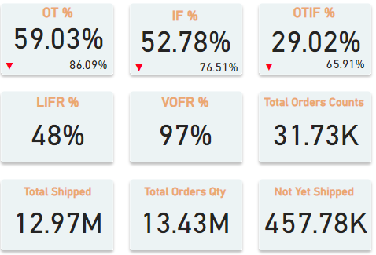

# **Mart FMCG Supply Chain Dashboard**

## **Overview**
 The Mart **FMCG Supply Chain Dashboard** is an interactive Power BI report designed to monitor and optimize the supply chain performance of an FMCG company. This dashboard provides insights into key performance metrics such as **On-Time Delivery (OT%)**, **In-Full Delivery (IF%)**, **On-Time In-Full (OTIF%)**, and **other crucial fulfillment KPIs**. It also offers detailed analysis across **customers, cities, product categories, and delivery delays** to help stakeholders make data-driven decisions.


# **Key Metrics & Measures**

To build this report, several key measures were created in Power BI using **DAX (Data Analysis Expressions)**:

## **1. On-Time Delivery (OT%)**

This metric calculates the percentage of orders delivered on or before the agreed delivery date.

```
OT % = CALCULATE(
    COUNT(fact_orders_aggregate[on_time]),
    fact_orders_aggregate[on_time]=1)/COUNT(fact_orders_aggregate[order_id])
```
## **2. In-Full Delivery (IF%)**

Represents the percentage of orders delivered with the full requested quantity.

```
IF % = CALCULATE(
    COUNT(fact_orders_aggregate[in_full]),
    fact_orders_aggregate[in_full]=1)/COUNT(fact_orders_aggregate[order_id])
```
## **3. On-Time In-Full Delivery (OTIF%)**

Combines on-time and in-full metrics to assess how often orders meet both criteria.

```
OTIF % = CALCULATE(
    COUNT(fact_orders_aggregate[otif]),
    fact_orders_aggregate[otif]=1)/COUNT(fact_orders_aggregate[order_id])
```

## **4. Fill Rate KPIs**

- **Line Fill Rate (LIFR%)**: Measures the percentage of line items delivered completely.
- **Volume Fill Rate (VOFR%)**: Represents the total volume delivered as a percentage of ordered volume.

```
LIFR % = CALCULATE(
    COUNT(fact_order_lines[On Time In Full]),
    fact_order_lines[On Time In Full]=1)/COUNT(fact_order_lines[order_id])

VOFR % = SUM(fact_order_lines[delivery_qty])/SUM(fact_order_lines[order_qty])
```

## **5. Order & Shipment Metrics**

- **Total Orders Count**
- **Total Orders Shipped**
- **Total Orders Quantity**
- **Not Yet Shipped Orders** (Pending shipments)

```
Total Orders = COUNT(fact_orders_aggregate[order_id])
Total Orders Shipped = SUM(fact_order_lines[delivery_qty])
Total Orders Qty = SUM(fact_order_lines[order_qty])
Not Yet Shipped = [Total Orders Qty]-[Total Orders Shipped]
```


# **Dashboard Components**

## **1. Split by Customers, Cities & Products**

- **Customer View**: Shows the performance of different customers in terms of **OTIF, IF, OT, LIFR, and VOFR**.
- **City View**: Compares different cities in terms of order fulfillment and delays.
- **Product Insights**: Displays how different products perform in terms of volume and fulfillment.


## **2. Field Parameter Selection (Button Bar)**

A button bar has been created using **Field Parameters** to allow users to dynamically switch between different metrics **(OT%, IF%, OTIF%, LIFR%, VOFR%, and Not Shipped%)**. This improves the interactive experience of the report.

.png)

## **3. Line & Area Charts**

- **Monthly Mart Supply Chain** (Area Chart) – Tracks supply chain trends over time.
- **Product Category Insights** (Area Chart) – Analyzes how different product categories perform in terms of total orders.
- **Product Wise Supply Chain** (Line Chart) – Displays product-level shipment trends.


## **4. Funnel Chart – Product Category by Quantity**

A **funnel chart** illustrates the distribution of order quantities across different product categories, highlighting the most and least ordered categories.


## **5. Clustered Column Chart – Total Orders by Delay Periods**

- **Days Difference Categories:**
  - **Negative values**: Orders delivered **before** the agreed delivery date.
  - **Zero**: Orders delivered **on** the agreed date.
  - **Positive values**: Orders **delayed** beyond the expected date.


## **6. Decomposition Tree – Product Category Breakdown**

A **decomposition tree** allows users to analyze order quantities across different levels, including:

- **Category** (Dairy, Beverages, etc.)
- **Product** (Milk, Biscuits, Tea, etc.)
- **City** (Ahmedabad, Vadodara, etc.)
- **Days Difference** (Delivery delay breakdown)


## **7. Tooltips & Additional Features**

Tooltips have been added for deeper analysis in:
- **Line Charts, Funnel Chart, Clustered Column Chart, and Decomposition Tree**.
- KPIs included in tooltips: **OT%, IF%, OTIF%, LIFR%, VOFR%, Total Orders, Total Shipped, Total Order Qty, and Not Yet Shipped.**


## **8. Dashboard Navigation & UI Elements**

- **Navigation Buttons**: Quick page navigation for better usability.
- **Info Button**: Provides additional details about the dashboard.
- **Filter & Clear Filter Buttons**: Created using Bookmarks to enable users to apply and reset filters quickly.
- **Design & UI**: Built using Figma for a clean and professional layout.


# **How to Use This Report**

1. **Navigate through different sections** using the button bar and field parameters.
2. **Analyze fulfillment performance** by looking at the OTIF, IF, and OT metrics.
3. **Identify delays and bottlenecks** using the clustered column chart and decomposition tree.
4. **Use filters and tooltips** to drill down into specific data points for better insights.
5. **Compare city-wise and customer-wise performance** to spot trends and improvement areas.

# **Conclusion**

This **Power BI FMCG Supply Chain Dashboard** provides a **comprehensive view of supply chain performance**, helping businesses **improve order fulfillment, reduce delays, and optimize logistics**. By leveraging **interactive visuals, KPIs, and drill-down analysis**, it enables data-driven decision-making to enhance supply chain efficiency.
